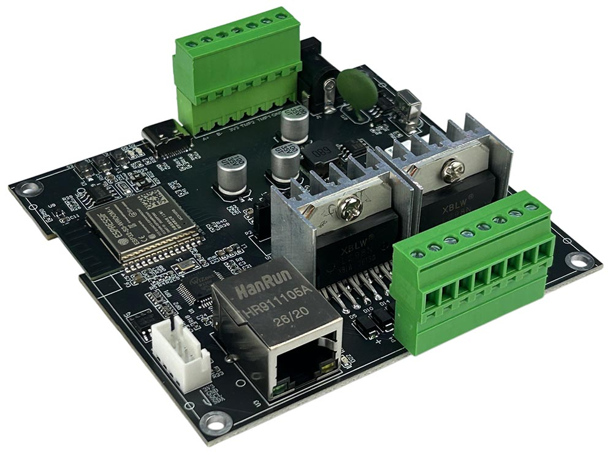

## Resources

- [ESP32 pin define details](https://www.kincony.com/forum/showthread.php?tid=9607)

## ESPHome Configuration

Here is an example YAML configuration for the KinCony MT4 ESP32-S3 DC motor driver board.

```yaml file=config.yaml
```

A more complex configuration using `globals`, `script`, `button`, and `number` entities to control motor directions and
speed from Home Assistant:

```yaml file=advanced.yaml
```
